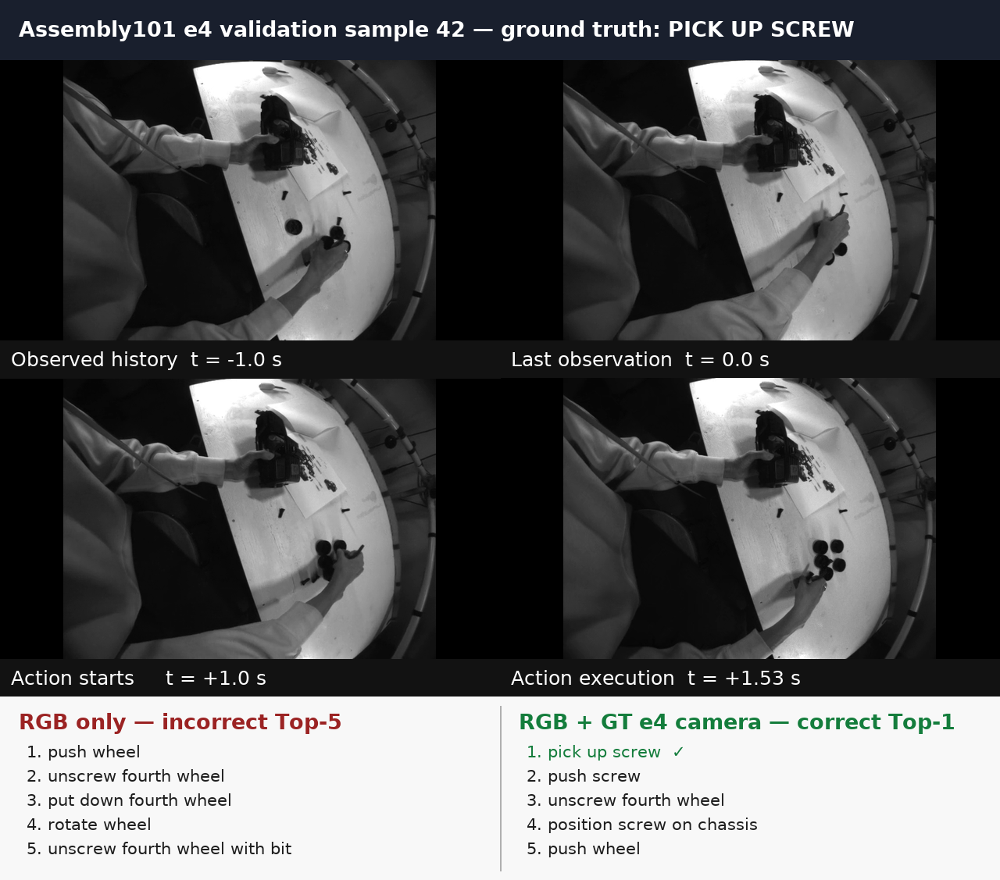

# EGO-HAND-WM H6/K16 trajectory fine-tuning

Status: trajectory-v2 training, validation-only model/sampler selection and the
held-out H2O/EgoPAT3D evaluations completed on 2026-07-23. These are results for
the shared **adapted H6/K16 protocol**, not direct reproductions of the methods'
native paper tables.

## Shared evaluation protocol

- History: 6 frames at 30 Hz, ending at the observation anchor.
- Future: 16 strictly future frames at 30 Hz, or 0.533 seconds.
- Coordinates: 3D wrist positions expressed in the last-observed-camera frame.
- Sampling: one predicted trajectory per context (`N=1`).
- Metrics: ADE over all 16 future positions and FDE at position 16, in
  centimeters.
- Common manifests and targets are used by EGO-HAND-WM and the adapted
  baselines.
- Checkpoints and inference hyperparameters are selected on the complete
  validation split.
- No future RGB/DINO features, future camera poses or future wrist coordinates
  are provided to the model at test time.
- No last-position/persistence residual is used.

Dataset sizes:

| Dataset/split | Train | Validation | Test |
|---|---:|---:|---:|
| H2O | 8,604 | 1,830 | 3,832 |
| EgoPAT3D | 14,280 | 1,735 | 3,353 seen / 4,686 unseen |

The train, validation and test manifests have zero sample, physical-video and
recording-group overlap.

## Changes from the original trajectory fine-tuning

### 1. Direct clean-state trajectory supervision

The original run primarily optimized rectified-flow velocity MSE over the
complete 207-dimensional geometric state. Wrist XYZ occupies only three of those
coordinates, while H2O and EgoPAT3D directly score wrist ADE/FDE.

For the flow interpolation

```text
x_t = (1 - t) z + t x_future
```

the model's clean-state estimate is

```text
x_hat_future = x_t + (1 - t) v_hat
```

Trajectory-v2 applies three losses to the wrist XYZ values in this estimate:

- a position loss over all valid future steps, with later horizons weighted more
  strongly;
- an endpoint loss at the final valid future step, directly aligned with FDE;
- a Smooth-L1 velocity loss between consecutive wrist positions, including the
  transition from the final observed wrist.

The selected fresh EgoPAT3D run uses:

```text
2.0 * L_position + 3.0 * L_endpoint + 0.05 * L_velocity
```

The selected H2O refinement uses:

```text
4.0 * L_position + 6.0 * L_endpoint + 0.05 * L_velocity
```

These are additional objectives; the model still predicts the complete geometry
through its rectified-flow ODE. It does not copy or add the last observed wrist
position to its output.

### 2. Lower future-DINO auxiliary weight

The future-DINO expert remains a training-time semantic world-model objective,
but DINO reconstruction is not the metric reported by the trajectory
benchmarks. Its weight was reduced from `1.0` to `0.1` in the fresh runs and
`0.05` in the H2O refinement. This prevents the high-dimensional visual
objective from overwhelming the sparse wrist-trajectory objective. The
future-DINO expert is not required to generate wrist trajectories at inference.

### 3. More conservative fine-tuning

The learning rate was reduced from `2e-5` to:

- `1e-5` for fresh fine-tuning from the VITRA checkpoint;
- `5e-6` for refinement from a previous trajectory checkpoint.

The lower rate reduces oscillation and catastrophic modification of the VITRA
representation. The selected H2O checkpoint is refinement step 1,200; the
selected EgoPAT3D checkpoint is fresh-fine-tuning step 5,950.

### 4. ADE-and-FDE checkpoint selection

The original runs selected checkpoints using ADE alone. Trajectory-v2 uses the
predeclared validation statistic

```text
selection_score = 0.5 * (ADE + FDE)
```

so average accuracy cannot improve by sacrificing the manipulation-critical
endpoint.

### 5. Validation-selected deterministic flow decoding

For each candidate checkpoint, the validation-only sweep considered:

```text
Heun ODE steps:       {8, 16}
initial noise scale:  {0.0, 0.5, 1.0}
```

Both datasets selected an initial noise scale of zero. This removes sampling
variance for the benchmark's single-trajectory point prediction. It is not a
persistence baseline: zero is neither the last observed wrist nor the future
target, and the learned ODE must still construct all 16 anchored future
positions.

The selected H2O decoder uses 8 Heun steps. The selected EgoPAT3D decoder uses
16, although the validation difference between 8 and 16 steps is negligible.

## Old-to-new test results

| Dataset/split | Original ADE/FDE (cm) | Trajectory-v2 ADE/FDE (cm) | Relative ADE/FDE improvement |
|---|---:|---:|---:|
| H2O | 2.610 / 4.261 | **1.917 / 3.478** | 26.5% / 18.4% |
| EgoPAT3D seen | 25.510 / 45.793 | **22.659 / 41.454** | 11.2% / 9.5% |
| EgoPAT3D unseen | 15.903 / 27.043 | **12.600 / 21.466** | 20.8% / 20.6% |

## Attribution on the complete validation splits

This comparison holds the validation data and metric implementation fixed.
`Original noise` means the unit Gaussian initialization used by the previous
evaluation. `Zero noise` is the validation-selected deterministic decoder.

| Dataset | Original training + original noise | New training + original noise | New training + zero noise |
|---|---:|---:|---:|
| H2O ADE/FDE (cm) | 2.711 / 4.589 | 2.152 / 3.993 | **1.933 / 3.594** |
| EgoPAT3D ADE/FDE (cm) | 16.290 / 27.377 | 14.914 / 23.424 | **13.074 / 21.481** |

The new loss and fine-tuning recipe therefore improve both datasets even under
the original noisy sampler. Deterministic decoding supplies a second,
substantial improvement rather than explaining the complete gain. Increasing
the EgoPAT3D decoder from 8 to 16 ODE steps contributes only approximately
0.023 cm ADE and 0.070 cm FDE on validation.

## Adapted HandsOnVLM comparison

| Dataset/split | Model | ADE (cm) | FDE (cm) |
|---|---|---:|---:|
| H2O | Adapted HandsOnVLM | 2.162 | 3.510 |
| H2O | **EGO-HAND-WM trajectory-v2** | **1.917** | **3.478** |
| EgoPAT3D seen | Adapted HandsOnVLM | 26.522 | 44.833 |
| EgoPAT3D seen | **EGO-HAND-WM trajectory-v2** | **22.659** | **41.454** |
| EgoPAT3D unseen | Adapted HandsOnVLM | 15.674 | 23.224 |
| EgoPAT3D unseen | **EGO-HAND-WM trajectory-v2** | **12.600** | **21.466** |

This comparison is fair at the shared adapted-protocol level: manifests,
history/future timing, coordinate anchoring, targets, `N=1` sampling and metrics
are matched. It must not be presented as a direct comparison to native paper
tables that use different preprocessing or temporal protocols.

## Integrity findings and limitations

- Test examples do not attach future-DINO features; future semantic features are
  training/validation auxiliary targets only.
- The context encoder reads observed state, time, visual context, text context
  and intrinsics. It does not read the future trajectory target.
- The old and trajectory-v2 reports use the same ADE/FDE implementation and the
  same test example counts.
- Validation gains are similar in direction and magnitude to test gains, which
  argues against a test-only reporting error.
- Deterministic zero-noise initialization is a legitimate validation-selected
  decoding hyperparameter, but it must be disclosed. Other stochastic baselines
  should receive a comparable validation-only decoding budget.
- The official test results have now been inspected during development. No
  further model decisions should be based on them. Multiple-seed reporting and
  confirmation on an untouched benchmark such as HOT3D-Clips are required for
  the strongest paper claim.
- Current results are single-seed results.

A controlled validation-only audit is queued as Slurm job `8631320` to run the
old checkpoints with every new noise/ODE setting. Its purpose is to quantify
sampler-only improvement without reopening or tuning on the test sets. Results
should be added here when that audit completes.

## Authoritative trajectory artifacts

- [H2O selected result](reports/h2o-vitra-h6k16-trajectory-v2-selected-test.json)
- [EgoPAT3D selected result](reports/egopat3d-vitra-h6k16-trajectory-v2-selected-test.json)
- [HandsOnVLM comparison](reports/trajectory-v2-handsonvlm-comparison.md)
- H2O checkpoint:
  `/scratch/jun.se/EGO-HAND-WM/runs/h2o-vitra-h6k16-trajectory-v2-refine/best.pt`
- EgoPAT3D checkpoint:
  `/scratch/jun.se/EGO-HAND-WM/runs/egopat3d-vitra-h6k16-trajectory-v2-iofix/best.pt`

# Assembly101-e4 Oracle Geometry for Semantic Action Anticipation

Status: all eight original controlled ablations and four wrist-reference follow-up ablations completed on 2026-07-20. Each model trained for 20 epochs and was evaluated every two epochs. The tables below report the checkpoint selected by overall action mean Top-5 recall on the validation set.

## Research question

This experiment asks how much semantic information about an upcoming action is contained in ground-truth future egocentric geometry:

- Does future headset motion help identify an upcoming action?
- Is wrist-root motion more informative than finger articulation?
- Does combining wrist motion and articulated hand pose help?
- Does camera motion explain gains that might otherwise be attributed to the hands?

This is an **oracle diagnostic**, not yet a deployable anticipation system. RGB is restricted to legal observations ending one second before the target action. Geometry-conditioned models additionally receive ground-truth geometry during the unseen one-second gap and target-action execution. Eventually, the GT future geometry must be replaced by geometry predicted by the world model.

## Dataset and controlled protocol

- Dataset: Assembly101.
- View: one egocentric stream, **e4**, per recording.
- e4 hardware IDs: `HMC_84358933_mono10bit` or `HMC_21179183_mono10bit`.
- These two IDs are replacement camera serials representing the same logical e4 view.
- The fixed exocentric `v4` stream is not used.
- Training and validation use the official Assembly101 anticipation splits.
- Validation contains 13,140 e4 action segments.
- The semantic prediction targets are 17 verbs, 90 objects and 1,064 fine-grained actions.
- The official anticipation horizon is one second: for an action beginning at frame `s`, the last legal RGB observation is `a = s - 30` at 30 fps.

### Temporal inputs

RGB history:

- 32 frames sampled at 8 Hz.
- Times relative to the last observed frame: -3.875 s through 0.0 s.
- No future RGB is supplied.

Oracle geometry:

- 32 history steps from -3.875 s through 0.0 s.
- 8 unseen-gap steps from +0.125 s through +1.0 s.
- 8 target-execution steps from +1.125 s through +2.0 s.
- Execution samples extending beyond an annotated action are clamped to its final frame and masked appropriately.

## Geometry preprocessing

Assembly101 supplies camera and wrist transforms in a shared world frame. Both trajectories are expressed in the fixed e4 camera frame at the last legal observation.

Let `A` be the e4 camera at observation cutoff `a`. The shared anchor transform is:

```text
T_A_W = inverse(T_W_Ce4(a))
```

Camera trajectory:

```text
T_A_C(t) = T_A_W T_W_Ce4(t)
```

Wrist-root trajectory:

```text
T_A_Hi(t) = T_A_W T_W_Hi(t)
```

Consequently, the e4 camera pose at the cutoff is identity, and all past/future camera and wrist poses share that fixed coordinate system. This is the last-observed-camera cumulative-pose convention used by the original eight runs; it is neither raw coordinate subtraction nor a frame-to-frame delta representation.

Each rigid pose is encoded as pose-9:

- translation: 3 values in metres;
- continuous rotation representation: 6 values.

The hand-pose-only signal removes global wrist motion. Each of the 21 hand landmarks is transformed from the released world frame into its instantaneous wrist frame:

```text
p_Hi(t) = inverse(T_W_Hi(t)) p_W(t)
```

Thus:

- `camera`: anchored e4 camera SE(3) trajectory;
- `wrist`: two anchored wrist-root SE(3) trajectories;
- `handpose`: two wrist-local 21-joint articulated poses;
- `whole_hand`: wrist roots plus wrist-local articulated poses.

The four follow-up runs change only the wrist-root reference. For each hand `i`, they use that hand's pose at the legal observation cutoff:

```text
T_Hi(a)_Hi(t) = inverse(T_W_Hi(a)) T_W_Hi(t)
```

The wrist pose is therefore identity at the cutoff and directly describes cumulative wrist motion from the last observation. The camera trajectory remains independently anchored to the last observed e4 camera. The wrist-local 21-joint articulation representation, temporal sampling, RGB features, model, optimizer, seed and evaluation protocol are unchanged. A hand whose tracker is invalid at the cutoff has no well-defined wrist anchor, so that hand's wrist stream is masked for the complete window in the follow-up; the original camera-anchored protocol masks wrist observations per timestamp.

Released hand confidence is used to mask unreliable wrist and hand-pose tokens.

## Visual representation and prediction architecture

The RGB branch uses frozen V-JEPA 2.1 ViT-G/16 (2B parameters) at 384-pixel resolution.

For every anticipation example:

1. The 32 observed e4 frames are encoded by the frozen V-JEPA target encoder.
2. The raw output contains 16 temporal tubelets, each with a 24 x 24 spatial token grid and width 1,664.
3. Each spatial grid is adaptively averaged to 4 x 4 while retaining all temporal tubelets.
4. The cached representation is therefore 256 x 1,664 FP16 tokens.
5. Training applies a learned LayerNorm and linear projection from 1,664 to 512.
6. Three learned semantic query tokens—verb, object and action—decode the visual tokens through two attentive probe blocks.

The optional geometry branch uses:

- input LayerNorm and projection to 512 dimensions;
- learned sequence-position embeddings;
- separate phase embeddings for history, unseen gap and action execution;
- continuous physical-time embeddings;
- a two-layer temporal Transformer;
- masked cross-attention from the three semantic queries to geometry tokens;
- a zero-initialized geometry residual so every geometry model begins from the same RGB pathway.

Separate linear heads predict verb, object and action.

## Ablations

1. RGB
2. RGB + GT camera
3. RGB + GT wrist
4. RGB + GT hand pose
5. RGB + GT whole hand
6. RGB + GT camera + wrist
7. RGB + GT camera + hand pose
8. RGB + GT camera + whole hand

## Training configuration

- Epochs: 20
- Validation interval: every 2 epochs
- Batch size: 32
- Optimizer: AdamW
- Learning rate: 1e-4
- Weight decay: 0.05
- Learning-rate step: epoch 12, multiplier 0.1
- Loss: equal-weight focal loss for verb, object and action, gamma 2.0
- Gradient clipping: 5.0
- Precision: BF16
- Seed: 42
- Checkpoint selection: validation action mean Top-5 recall

V-JEPA feature extraction used batch size 8 per H200 GPU across four independent GPU shards. The encoder remained frozen during extraction and downstream training.

## Complete validation results

All values are percentages. `mT5R` is class-mean Top-5 recall. Overall Top-1 is sample-level accuracy. Tail and unseen subsets use class-mean Top-5 recall.

### Original eight conditions: overall

| Condition | Best epoch | Action mT5R | Action Top-1 | Verb mT5R | Verb Top-1 | Object mT5R | Object Top-1 |
|---|---:|---:|---:|---:|---:|---:|---:|
| RGB | 14 | 6.815 | 10.624 | 59.900 | 28.569 | 19.983 | 19.734 |
| RGB + camera | 14 | 7.948 | 12.397 | 64.233 | 35.038 | 21.814 | 21.400 |
| RGB + wrist | 14 | 11.566 | 18.957 | 74.131 | 49.886 | 24.675 | 27.953 |
| RGB + hand pose | 10 | 8.037 | 13.288 | 66.367 | 35.951 | 22.310 | 22.557 |
| **RGB + whole hand** | **14** | **12.006** | **21.157** | 74.068 | **50.609** | 24.118 | **30.373** |
| RGB + camera + wrist | 14 | 11.262 | 19.414 | **74.710** | 49.216 | 24.088 | 28.219 |
| RGB + camera + hand pose | 16 | 8.315 | 12.983 | 63.892 | 35.921 | 22.310 | 21.606 |
| RGB + camera + whole hand | 14 | 11.496 | 20.525 | 74.039 | 50.518 | **25.946** | 30.046 |

### Original eight conditions: tail classes

| Condition | Action mT5R | Verb mT5R | Object mT5R |
|---|---:|---:|---:|
| RGB | 3.100 | 56.153 | 18.500 |
| RGB + camera | 4.023 | 58.574 | 20.435 |
| RGB + wrist | 6.377 | **71.305** | 23.125 |
| RGB + hand pose | 4.143 | 62.983 | 20.542 |
| **RGB + whole hand** | **6.501** | 70.471 | 22.929 |
| RGB + camera + wrist | 6.022 | 70.463 | 22.130 |
| RGB + camera + hand pose | 4.333 | 58.902 | 21.456 |
| RGB + camera + whole hand | 6.138 | 68.960 | **24.663** |

### Original eight conditions: unseen toys

| Condition | Action mT5R | Verb mT5R | Object mT5R |
|---|---:|---:|---:|
| RGB | 7.471 | 60.098 | 20.879 |
| RGB + camera | 8.686 | 64.401 | 22.696 |
| RGB + wrist | 12.341 | 75.378 | 24.920 |
| RGB + hand pose | 8.777 | 66.768 | 22.572 |
| **RGB + whole hand** | **12.713** | **75.541** | 24.238 |
| RGB + camera + wrist | 11.968 | 75.206 | 24.471 |
| RGB + camera + hand pose | 8.887 | 63.687 | 21.437 |
| RGB + camera + whole hand | 12.402 | 74.623 | **27.201** |

## Wrist-reference follow-up results

These four runs use `data.wrist_reference=last_observed_wrist`. All values are percentages and come from each run's best validation checkpoint selected by overall action mT5R.

### Follow-up overall

| Condition | Wrist-root reference | Best epoch | Action mT5R | Action Top-1 | Verb mT5R | Verb Top-1 | Object mT5R | Object Top-1 |
|---|---|---:|---:|---:|---:|---:|---:|---:|
| RGB + wrist | Last observed wrist | 14 | 10.258 | 16.826 | 71.200 | 45.129 | **24.528** | 25.967 |
| RGB + whole hand | Last observed wrist | 16 | 7.489 | 11.857 | 64.537 | 35.419 | 22.125 | 21.119 |
| RGB + camera + wrist | Last observed wrist | 18 | 7.359 | 11.842 | 63.066 | 34.840 | 21.979 | 20.928 |
| **RGB + camera + whole hand** | **Last observed wrist** | **16** | **10.261** | **17.070** | **72.501** | **46.035** | 24.240 | **26.659** |

### Follow-up tail classes

| Condition | Action mT5R | Verb mT5R | Object mT5R |
|---|---:|---:|---:|
| **RGB + wrist** | **5.457** | 67.074 | **22.794** |
| RGB + whole hand | 3.659 | 60.309 | 20.724 |
| RGB + camera + wrist | 3.587 | 56.694 | 21.261 |
| RGB + camera + whole hand | 5.391 | **69.063** | 22.693 |

### Follow-up unseen toys

| Condition | Action mT5R | Verb mT5R | Object mT5R |
|---|---:|---:|---:|
| RGB + wrist | 10.687 | 72.036 | 25.265 |
| RGB + whole hand | 8.655 | 64.355 | 24.229 |
| RGB + camera + wrist | 8.065 | 63.580 | 22.674 |
| **RGB + camera + whole hand** | **10.907** | **73.043** | **25.527** |

### Direct wrist-reference comparison

This table holds the condition name and all training choices fixed. Positive deltas would favor last-observed-wrist anchoring; all observed deltas are negative. The validity rule necessarily differs when a cutoff wrist anchor is unavailable, as documented above.

| Condition | Camera-anchored wrist action mT5R | Last-wrist-anchored action mT5R | Delta |
|---|---:|---:|---:|
| RGB + wrist | 11.566 | 10.258 | -1.308 |
| RGB + whole hand | 12.006 | 7.489 | -4.517 |
| RGB + camera + wrist | 11.262 | 7.359 | -3.903 |
| RGB + camera + whole hand | 11.496 | 10.261 | -1.235 |

## Main findings

1. **Future whole-hand geometry is the strongest action-semantic oracle.** RGB + whole hand improves action mT5R from 6.815 to 12.006, an absolute gain of 5.191 points and approximately 76% relative improvement.
2. **Wrist-root motion explains most of the geometry benefit.** Wrist alone reaches 11.566 action mT5R, whereas wrist-local finger articulation alone reaches 8.037.
3. **Finger articulation adds information beyond the wrist.** Whole hand improves over wrist by 0.440 action-mT5R points and raises action Top-1 from 18.957 to 21.157.
4. **Camera motion is informative but indirect.** Camera alone improves RGB action mT5R by 1.133 points and verb mT5R by 4.333 points.
5. **Camera motion is not consistently additive once wrist geometry is present.** Camera + wrist and camera + whole hand perform slightly below their camera-free counterparts for action mT5R. Camera + whole hand nevertheless produces the strongest overall and unseen object recall.
6. **The geometry advantage extends to difficult subsets.** Whole hand is best for tail and unseen action recall.

### Wrist-reference follow-up findings

1. **Separately anchoring each wrist does not improve semantic anticipation in this setup.** It lowers action mT5R for all four matched conditions.
2. **The original camera-anchored wrist contains more than motion.** It retains the hand's location and orientation relative to the observed egocentric camera, whereas last-wrist anchoring makes the cutoff pose identity and discards that initial hand-to-camera spatial configuration.
3. **Camera + whole hand is the strongest last-wrist-anchored follow-up.** It reaches 10.261 action mT5R and leads the follow-up on unseen action, verb and object recall, but remains 1.235 points below its original camera-anchored counterpart.
4. **Whole-hand articulation is sensitive to the wrist reference.** Whole hand without camera drops from 12.006 to 7.489 action mT5R, suggesting that wrist-local articulation is most useful when paired with the original camera-relative wrist-root context in the current fusion architecture.

## Camera-motion audit

The e4 transforms were checked against the independent `camera_position_ego` stream in the raw Assembly101 pose release. For both possible e4 hardware serials:

- the transform translation exactly matches the released camera world position;
- rotations have determinant approximately 1 and are numerically orthonormal;
- the selected transform is the moving egocentric e4 camera, not fixed-camera v4;
- the last observed e4 pose becomes identity after anchoring.

Across 12,374 validation segments with released geometry, maximum future e4 motion relative to the last observed frame is:

| Period | Median translation | Median rotation | 90th-percentile translation | 90th-percentile rotation |
|---|---:|---:|---:|---:|
| Unseen one-second gap | 3.72 cm | 7.33 deg | 10.80 cm | 20.65 deg |
| Action execution | 5.49 cm | 10.41 deg | 14.42 cm | 25.97 deg |
| Complete future | 5.77 cm | 11.12 deg | 14.68 cm | 26.63 deg |

The camera trajectories are therefore not generally static, although motion is substantially less action-specific than wrist motion.

## Timing-alignment audit

The official semantic boundaries are expressed at 30 fps while the raw MP4 and pose release are 60 Hz. The conversion is `raw_frame = 2 * annotation_frame`. Across all 13,140 validation segments, the observation cutoff is exactly 30 annotation frames (60 raw frames) before the target start, i.e. exactly one second.

The target boundary, observation anchor and phase boundaries are exact. There is one minor sub-frame-sampling detail in the completed runs: V-JEPA history frames were rounded directly on the 60-Hz grid, while the compact geometry cache retained the even 60-Hz frames corresponding to the 30-Hz annotation grid. Consequently, 24 of 32 history sample positions use the identical raw frame and 8 use adjacent raw frames. The maximum discrepancy is one raw frame, or 16.7 ms. Camera and wrist geometry remain mutually aligned, and the last observed frame and +1-second target start are exactly aligned. A strict future rerun can remove the 16.7-ms discrepancy by retaining 60-Hz geometry or forcing RGB samples onto the even-frame grid.

## Qualitative validation example

Validation segment 42:

- Recording: `nusar-2021_action_both_9033-a30_9033_user_id_2021-02-04_131528`
- View: `HMC_21179183_mono10bit` (e4)
- Ground truth: **pick up screw**
- RGB Top-5 does not contain the correct action.
- RGB + GT camera predicts **pick up screw** as Top-1.

[Watch the annotated e4 evaluation clip](artifacts/assembly101_segment42_e4_clip.mp4)



The clip contains observed history, the unseen one-second gap and the target execution. It is extracted from the original full e4 recording and is not generated video.

The original segment 42 example has an earlier occurrence of `pick up screw` near the observation cutoff, followed by `put down screw` and `push wheel` during the one-second gap. Its target `pick up screw` segment still begins exactly at +1.0 s, but the repeated label makes the boundary visually ambiguous.

### Additional clearer camera-helped examples

The following validation cases satisfy two qualitative-selection criteria: RGB misses the target in its action Top-5 while RGB + GT camera predicts it as Top-1, and the target action label does not occur inside the preceding one-second window. Every clip shows one second of observed history, the exact one-second unseen gap, and one second of target execution. The bottom overlay displays the official action label active at every frame.

- [Segment 158: rotate partial toy](artifacts/assembly101_e4_examples/segment_00158_rotate_partial_toy_e4.mp4)
- [Segment 397: pick up screw](artifacts/assembly101_e4_examples/segment_00397_pick_up_screw_e4.mp4)
- [Segment 516: unscrew second wheel with screwdriver](artifacts/assembly101_e4_examples/segment_00516_unscrew_second_wheel_with_screwdriver_e4.mp4)
- [Segment 758: unscrew chassis with screwdriver](artifacts/assembly101_e4_examples/segment_00758_unscrew_chassis_with_screwdriver_e4.mp4)
- [Segment 1088: unscrew track with screwdriver](artifacts/assembly101_e4_examples/segment_01088_unscrew_track_with_screwdriver_e4.mp4)

## Limitations and required follow-up

- These are oracle results because future GT geometry is supplied. They measure an upper-bound diagnostic rather than deployable anticipation performance.
- The experiment currently uses one random seed. Multiple seeds are required to quantify variance, especially for the smaller camera differences.
- This is a controlled e4-only Assembly101 variant; it should not be presented as directly reproducing multi-view or exocentric headline results.
- Geometry is fully unavailable for 764 validation examples: 555 examples come from three recordings missing released geometry, and 209 have observation anchors beyond two truncated pose streams. Those examples remain in every condition, but geometry is fully masked, so geometry-conditioned models reduce to RGB. Two additional examples have only partial future geometry and are masked per timestamp.
- The last-observed-wrist follow-up additionally requires a valid tracked wrist at the cutoff. If one hand lacks that anchor, its complete wrist trajectory is masked instead of silently selecting a different reference frame.
- Test-set inference has not yet been run; all reported numbers are validation results.
- A shuffled-camera and zero-camera control would distinguish trajectory information from architectural/fusion effects.
- The key next experiment is to replace GT future wrist/hand geometry with geometry predicted by the ego-hand world model and measure how much of the oracle gain remains.

## Artifacts

- Run checkpoints and metric histories: `/projects/torresani-lab/sejoon/runs/assembly101_e4_oracle`
- Last-observed-wrist follow-up checkpoints and metric histories: `/projects/torresani-lab/sejoon/runs/assembly101_e4_oracle_wrist_anchor`
- Dataset: `/projects/torresani-lab/sejoon/datasets/Assembly101`
- V-JEPA feature cache: `/projects/torresani-lab/sejoon/datasets/Assembly101/derived/e4_anticipation/vjepa2_vitg16_384`
- Geometry cache: `/projects/torresani-lab/sejoon/datasets/Assembly101/derived/e4_anticipation/geometry_oracle_8hz`
- Example video: `artifacts/assembly101_segment42_e4_clip.mp4`
- Additional example videos: `artifacts/assembly101_e4_examples/`
- Example frame montage: `artifacts/assembly101_segment42_camera_example.png`

---

# USST H6/K16 trajectory-forecasting baselines

Recorded on 2026-07-21. These are results from the adapted USST baseline, not the native temporal setting reported in the USST paper. Both datasets use six observed frames and predict sixteen future frames at 30 Hz, giving a 0.533-second prediction horizon. Validation was run after every epoch, and checkpoint selection used the lowest validation 3D mADE.

## Final held-out results

All 3D ADE, FDE and per-axis errors are in metres. The normalized 2D metrics are reported in the model's projective coordinate space.

| Dataset split | Selected epoch | 3D mADE | 3D mFDE | Normalized 2D ADE | Normalized 2D FDE | mDX | mDY | mDZ |
|---|---:|---:|---:|---:|---:|---:|---:|---:|
| H2O test | 2 | **0.171376** | **0.172569** | 0.211311 | 0.209667 | 0.118 | 0.065 | 0.068 |
| EgoPAT3D seen test | 1 | 0.315483 | 0.469614 | 0.172399 | 0.190111 | 0.138 | 0.104 | 0.223 |
| EgoPAT3D unseen test | 1 | **0.221267** | **0.257551** | **0.150318** | **0.172921** | **0.117** | **0.081** | **0.133** |

Test-set sizes were 3,832 windows for H2O, 3,353 for EgoPAT3D seen and 4,686 for EgoPAT3D unseen.

## Checkpoint selection and stopping history

| Dataset | Best validation epoch | Best validation mADE | Best validation mFDE | Epoch-20 train loss | Epoch-20 validation mADE | Epoch-20 validation mFDE |
|---|---:|---:|---:|---:|---:|---:|
| H2O | 2 | **0.174069** | **0.176** | 0.639669 | 0.217 | 0.218 |
| EgoPAT3D | 1 | **0.223308** | **0.279** | 0.596805 | 0.248 | 0.291 |

Neither validation curve improved after its early best checkpoint. Both training jobs were therefore stopped intentionally at epoch 20, and their already queued evaluations were released to run from the best checkpoints. The `CANCELLED` training states are deliberate early stops rather than training failures; both evaluation jobs completed successfully with exit code `0:0`.

- H2O training/evaluation jobs: `8535411` / `8535435`
- EgoPAT3D training/evaluation jobs: `8535412` / `8535436`

The aggregate training loss is not a reliable proxy for geometric generalization in these runs. Its initial value near 4,160 was dominated by the softplus uncertainty term: `2 hands × 3 axes × ln(2) × 1000 ≈ 4,159`. The loss then fell below one while validation mADE had already stopped improving. This is why the best checkpoints were selected by validation mADE rather than final training loss.

## Adapted configurations

- **H2O:** 8,604 training and 1,830 validation windows; anchored local/projective and centralized trajectory representation; frozen ResNet-18 RGB encoder with location input; batch size 128.
- **EgoPAT3D:** 14,280 training and 1,735 validation windows; anchor-camera metric XYZ with dataset standardization and odometry; frozen ResNet-18 RGB encoder with location input; batch size 128.
- **Shared forecast:** H6/K16 at 30 Hz, using six observed samples and sixteen future samples.
- **Loss:** uncertainty-aware USST objective with Huber delta `1e-5` and loss scale `1000`.

## Reproducibility artifacts

- H2O checkpoint: `/projects/torresani-lab/sejoon/runs/baselines/USST/H2O/paper-h6k16-res18-fullval-v2-seed0/snapshot/best.pth`
- [H2O paired test metrics](/projects/torresani-lab/sejoon/runs/baselines/USST/H2O/paper-h6k16-res18-fullval-v2-seed0/test-e2/paired_metrics.json)
- H2O predictions: `/projects/torresani-lab/sejoon/runs/baselines/USST/H2O/paper-h6k16-res18-fullval-v2-seed0/test-e2/test_results.npz`
- EgoPAT3D checkpoint: `/projects/torresani-lab/sejoon/runs/baselines/USST/EgoPAT3D/paper-h6k16-res18-xyzstd-v2-seed0/snapshot/best.pth`
- [EgoPAT3D paired test metrics](/projects/torresani-lab/sejoon/runs/baselines/USST/EgoPAT3D/paper-h6k16-res18-xyzstd-v2-seed0/test-e1/paired_metrics.json)
- EgoPAT3D seen predictions: `/projects/torresani-lab/sejoon/runs/baselines/USST/EgoPAT3D/paper-h6k16-res18-xyzstd-v2-seed0/test-e1/test_seen.npz`
- EgoPAT3D unseen predictions: `/projects/torresani-lab/sejoon/runs/baselines/USST/EgoPAT3D/paper-h6k16-res18-xyzstd-v2-seed0/test-e1/test_unseen.npz`

## MMTwin H6/K16 metric-XYZ baseline

The post-change MMTwin evaluation completed successfully on 2026-07-22. It uses the same H6/K16 manifests and anchor-camera metric-XYZ coordinate contract as the adapted EgoPAT3D setting above. The frozen visual encoder is DINOv3 ViT-L/16. Evaluation uses one generated sample per input and 200 diffusion sampling steps.

| Dataset split | 3D mADE | 3D mFDE | Normalized 2D ADE | Normalized 2D FDE | Evaluated windows |
|---|---:|---:|---:|---:|---:|
| H2O test | **0.094716** | 0.257820 | **0.118363** | 0.308178 | 3,832 |
| EgoPAT3D seen test | 0.316877 | 0.471885 | 0.166726 | 0.191944 | 3,353 |
| EgoPAT3D unseen test | **0.200711** | **0.244063** | **0.142371** | **0.168895** | 4,686 |

All three tasks in Slurm array `8543181` completed with exit code `0:0`.

- H2O checkpoint: `/projects/torresani-lab/sejoon/runs/baselines/MMTwin/paper-h6k16-xyz-v1-seed0-h2o/best.pt`
- [H2O test metrics](/projects/torresani-lab/sejoon/runs/baselines/MMTwin/paper-h6k16-xyz-v1-seed0-h2o/metrics-test-n1.json)
- EgoPAT3D checkpoint: `/projects/torresani-lab/sejoon/runs/baselines/MMTwin/paper-h6k16-xyz-v1-seed0-egopat3d/best.pt`
- [EgoPAT3D seen-test metrics](/projects/torresani-lab/sejoon/runs/baselines/MMTwin/paper-h6k16-xyz-v1-seed0-egopat3d/metrics-test_seen-n1.json)
- [EgoPAT3D unseen-test metrics](/projects/torresani-lab/sejoon/runs/baselines/MMTwin/paper-h6k16-xyz-v1-seed0-egopat3d/metrics-test_novel-n1.json)
